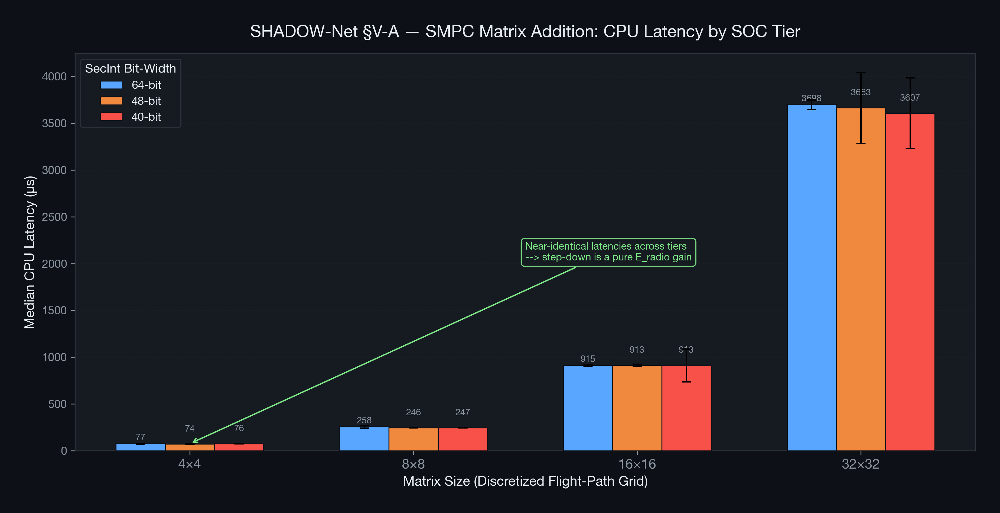
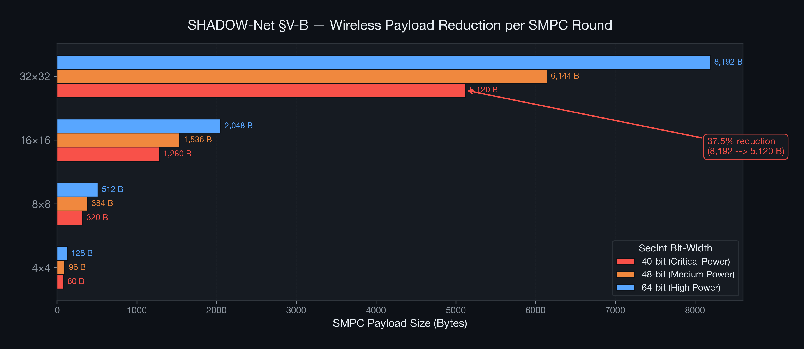
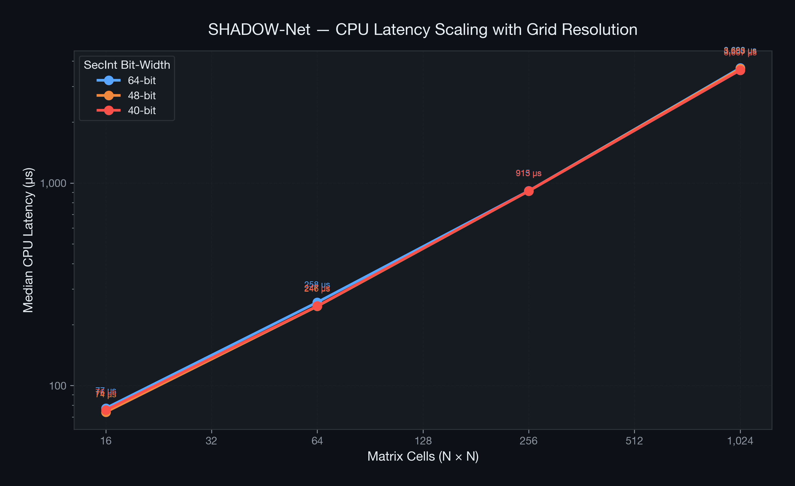

# 🛡️ SHADOW-Net

### Delay-Aware Dynamic SMPC and Opportunistic Caching in Privacy-Preserving FANETs

[](https://www.python.org/)
[](https://github.com/lschoe/mpyc)
[](https://docs.docker.com/compose/)
[](https://omnetpp.org/)
[](LICENSE)

> **Paper:** *SHADOW-Net: Delay-Aware Dynamic SMPC and Opportunistic Caching in Privacy-Preserving FANETs*  
> **Author:** Amauri Ribeiro

---

## 📋 Abstract

The rapid integration of Unmanned Aerial Vehicles (UAVs) into urban logistics has raised critical concerns regarding business privacy. Broadcast regulations, such as **Remote ID**, mandate cleartext trajectory sharing, exposing proprietary routing data to competing fleets. While decentralized **Secure Multi-Party Computation (SMPC)** eliminates the Single Point of Failure (SPOF) associated with centralized servers, standard SMPC matrix operations impose severe computational burdens on edge devices.

**SHADOW-Net** proposes a **SWaP-Aware** (Size, Weight, and Power) architecture that:

- 🔋 **Dynamically scales** the cryptographic field size (64 → 48 → 40 bits) based on real-time **State of Charge (SOC)**
- 📡 **Reduces wireless payload by 37.5%** during critical battery states
- 🗺️ Integrates **opportunistic Sky Caching** to reduce FANET polling overhead
- 📻 Applies **probabilistic overhearing mitigation** to conserve radio energy

---

## 🏗️ Architecture

```
┌─────────────────────────────────────────────────────────────┐
│                    SHADOW-Net Protocol                       │
├──────────────┬──────────────────┬───────────────────────────┤
│  Crypto Engine│  Sky Cache Layer │  Overhearing Mitigation   │
│  (§IV-A)      │  (§IV-B)         │  (§IV-C)                  │
│               │                  │                           │
│  SOC > 70%   │  ConSens Cache   │  PSM Sleep Mode            │
│  → 64-bit    │  Lazy Request    │  (SOC ≤ 30%)              │
│               │  Temporal TTL    │                           │
│  30% < SOC   │                  │  Probabilistic             │
│  → 48-bit    │  Geographic      │  Listening MAC             │
│               │  Sky Caches      │                           │
│  SOC ≤ 30%   │                  │  Load Deferral to          │
│  → 40-bit    │                  │  High-SOC Nodes            │
└──────────────┴──────────────────┴───────────────────────────┘
         │                                      │
         ▼                                      ▼
┌─────────────────────┐          ┌──────────────────────────┐
│  MPyC SMPC Engine    │          │  IEEE 802.11 Ad-Hoc MAC  │
│  Shamir's Secret     │          │  AODV Routing (FANET)    │
│  Sharing             │          │  3D Mobility Model       │
└─────────────────────┘          └──────────────────────────┘
```

---

## 📂 Repository Structure

```
shadow-protocol/
├── shadow_smpc.py                  # Core SMPC cryptographic engine (§IV-A)
├── benchmark_harness.py            # Microbenchmark harness with stats (§V-A)
├── generate_figures.py             # Publication-quality chart generator
├── requirements.txt                # Python dependencies
├── Dockerfile                      # Container (RPi4 SWaP emulation)
├── docker-compose.yml              # Multi-drone simulation (3 SOC tiers)
├── docker-compose.benchmark.yml    # Benchmark-specific compose
├── figures/
│   ├── fig1_cpu_latency_comparison.png
│   ├── fig2_payload_reduction.png
│   └── fig3_latency_scaling.png
├── results/                        # Raw benchmark data (CSV + JSON)
│   ├── benchmark_raw.csv
│   ├── benchmark_summary.json
│   ├── benchmark_8x8.csv / .json
│   ├── benchmark_16x16.csv / .json
│   └── benchmark_32x32.csv / .json
└── omnetpp/
    ├── ShadowManet.ned             # 3D FANET topology (5 UAVs)
    └── omnetpp.ini                 # Simulation config (3 scenarios)
```

---

## ⚡ Quick Start

### Prerequisites

- Python 3.11+
- Docker & Docker Compose (optional, for SWaP emulation)
- OMNeT++ 6.x with INET 4.x (optional, for network simulation)

### 1. Install Dependencies

```bash
pip install -r requirements.txt
```

### 2. Run the SMPC Engine

```bash
# High-Power State (SOC > 70%) — 64-bit SecInt
python shadow_smpc.py --soc 85

# Medium-Power State (30% < SOC ≤ 70%) — 48-bit SecInt
python shadow_smpc.py --soc 50

# Critical-Power State (SOC ≤ 30%) — 40-bit SecInt
python shadow_smpc.py --soc 20
```

### 3. Run the Microbenchmark

```bash
mkdir -p results
python benchmark_harness.py --iterations 30 --rows 4 --cols 4
```

### 4. Generate Figures

```bash
python generate_figures.py
# Output: figures/fig1_*.png, fig2_*.png, fig3_*.png
```

### 5. Docker SWaP Emulation (Raspberry Pi 4)

```bash
# Run all three SOC tiers under RPi4 constraints
docker compose up --build

# Run benchmark under RPi4 constraints
docker compose -f docker-compose.benchmark.yml up --build
```

---

## 🔬 SWaP-Aware Dynamic Field Scaling (§IV-A)

The core innovation: the SMPC secret share bit-width adapts to battery state.

| SOC Tier | Condition | SecInt | Bytes/Cell | Payload Δ |
|---|---|---|---|---|
| 🟢 High-Power | SOC > 70% | 64-bit | 8 B | baseline |
| 🟡 Medium-Power | 30% < SOC ≤ 70% | 48-bit | 6 B | **−25.0%** |
| 🔴 Critical-Power | SOC ≤ 30% | 40-bit | 5 B | **−37.5%** |

> A matrix cell only needs 8 useful bits (values 0–255 for colliding drones). The remaining bits are **security padding** that SHADOW-Net scales dynamically.

---

## 📊 Microbenchmark Results (§V-A)

Empirical results from 30 iterations per tier with 3 warmup iterations:

### CPU Latency — SMPC Matrix Addition



**Key finding:** CPU latency is **near-identical** across all three tiers (< 3% median difference), confirming that the step-down imposes **no measurable E_cpu penalty**.

### Wireless Payload Reduction



**Headline metric:** The 37.5% payload reduction at Critical-Power is a deterministic, exact value: `(64 − 40) / 64 = 0.375`.

### Latency Scaling with Grid Resolution



---

## 🌐 Network Topology — OMNeT++ / INET (§III-A)

The `omnetpp/` directory contains the FANET simulation skeleton:

- **5 UAV nodes** (`AdhocHost`) in a **1 km × 1 km × 500 m** 3D airspace
- **IEEE 802.11** Ad-Hoc MAC layer with `Ieee80211ScalarRadioMedium`
- **AODV** reactive routing for dynamic MANET topology
- **3D `RandomWaypointMobility`** with altitude constraints (50–500 m)
- **Three simulation scenarios** matching the SOC tiers

```bash
# In OMNeT++ IDE: import omnetpp/ as a project
# Or from CLI:
opp_run -r 0 -c HighPower -n .:$INET_ROOT/src omnetpp/omnetpp.ini
```

### Docker Resource Limits (RPi4 Emulation)

| Constraint | Value | Rationale |
|---|---|---|
| `cpus` | `0.50` | Single-core equiv. of BCM2711 Cortex-A72 |
| `memory` | `1 GB` | Worst-case Raspberry Pi 4 variant |
| `pids` | `100` | Fork-bomb protection |

---

## 🔒 Threat Model (§III-B)

**Semi-Honest (Honest-but-Curious):** Logistics competitors strictly follow the collision avoidance protocol but attempt to infer proprietary routing intelligence by analyzing intercepted SMPC matrices over the wireless medium.

---

## 📚 References

1. G. Ding et al., "Routing with Privacy for Drone Package Delivery Systems," *ICRAT*, 2022.
2. A. R. Svaigen et al., "MixDrones: A Mix Zones-based Location Privacy Protection Mechanism for the Internet of Drones," *MSWiM '21*, 2021.
3. A. Desai et al., "Privacy-Preserving Collision Detection for Drone-based Aerial Package Delivery using Secure Multi-Party Computation," *MobiHoc '23*, 2023.
4. S. Lim et al., "Adaptive Path Planning of UAVs for Delivering Delay-Sensitive Information to Ad-Hoc Nodes," *IEEE Trans. Mobile Computing*, 2025.
5. S. Lim et al., "Drone Helps Privacy: Sky Caching Assisted k-Anonymity in Spatial Querying," *IEEE IoT Journal*, 2026.

---

## 📄 License

This project is licensed under the MIT License — see the [LICENSE](LICENSE) file for details.

---

## 👤 Author

**Amauri Ribeiro** — [@Ribeirosk8](https://github.com/Ribeirosk8)

---

<p align="center">
  <i>SHADOW-Net: Ensuring kinetic survivability while protecting proprietary routing data.</i>
</p>
